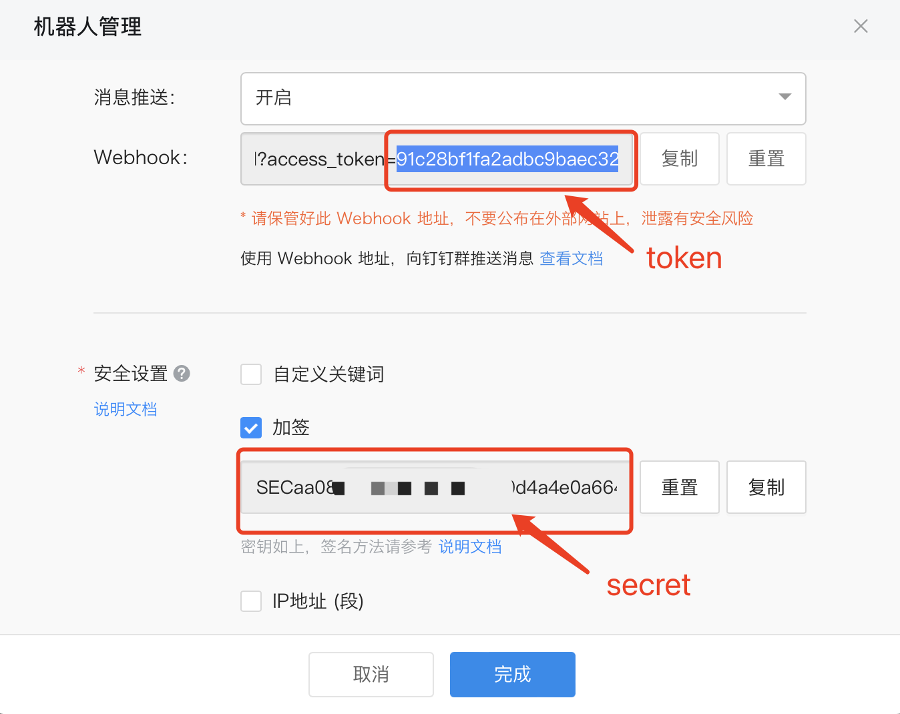
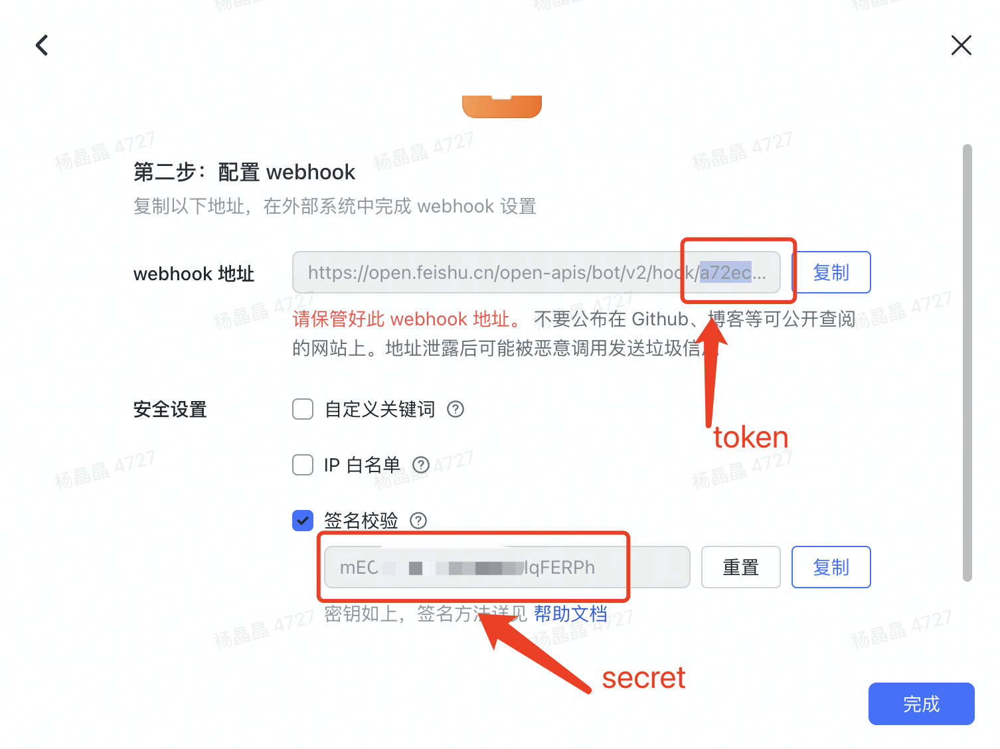

# cloud-build-notify

google cloud build CI notify / 仅支持MarkDown格式消息推送

Docker Image At: [https://hub.docker.com/r/nmgsz/cloud-build-notify/tags](https://hub.docker.com/r/nmgsz/cloud-build-notify/tags)

## 1、DingTalk

> 因google cloud run机器IP并不是固定的，钉钉通知通过签名形式验签

### 命令原型
````
notify dingTalk --token=xxxx --secret=xxxx --title=xxx --content=xxxx
````

### Cloud Build yaml
````
steps:
  - name: 'nmgsz/cloud-build-notify'
    args: [
      'dingTalk',
      '--token',
      '${_DING_TOKEN}',
      '--secret',
      '${_DING_SECRET}',
      '--title',
      'deploy ${_ENV} success',
      '--content',
      '## panic  \n> Account: test  \n> Msg: message  \n'
    ]
````

### 参数`--token`、`--secret`示意图



## 2、FeiShu

### 命令原型
````
notify feiShu --token=xxxx --secret=xxxx --title=xxx --content=xxxx
````

### Cloud Build yaml
````
steps:
  - name: 'nmgsz/cloud-build-notify'
    args: [
      'feiShu',
      '--token',
      '${_DING_TOKEN}',
      '--secret',
      '${_DING_SECRET}',
      '--title',
      'deploy ${_ENV} success',
      '--content',
      '## panic  \n> Account: test  \n> Msg: message  \n'
    ]
````

### 参数`--token`、`--secret`示意图


